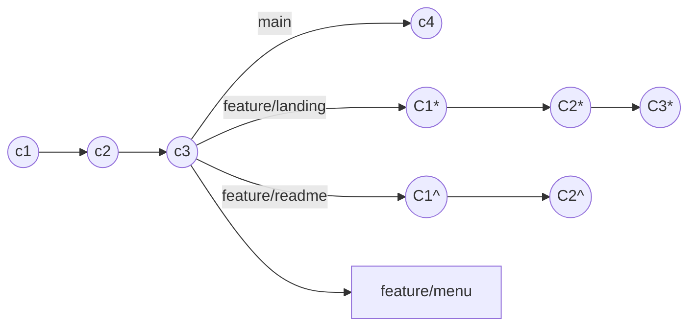

# Aprendiendo GIT

Para iniciar clona este proyecto en tu workspace local, estaremos usando las carpetas de este repositorio que a su vez son respositorios.

## Config

La configuración de este proyecto es la siguiente

Vamos a tener 4 ramas.

- main
- feature/landing
- feature/menu
- feature/readme

Para los ejercicios no necesariamente vamos a usar todas las ramas, se indicará en cada uno ¿cuál es el propósito?

### Que vamos a aprender al resolver este ejercicio

- ¿Qué es lo mínimo que debo entender de GIT?
- ¿Cómo es el commit perfecto?
- ¿Qué tipos de workflows existen para trabajo distribuidos?
- ¿Qué tipo de workflow se parece más el gráfico de la config?
- ¿Cuál es la diferencia entre rebase vs merge vs squash?
- ¿Qué es un merge commit?
- ¿Qué es un squash commit?
- ¿Cómo modificar/eliminar un commit?
- ¿Cómo fusionar commits?
- ¿Cuándo usar cherry-pick?
- Log vs Reflog
- ¿Cuándo hacer un reset y por qué es peligroso?
-

### Caso #1:

### Caso #2:

### Caso #3:

### Caso #4:

### Caso #5:

### Caso #6:

### Caso #7:

### Caso #8:

### Caso #9:

### Caso #10:

### Caso #11:

### Caso #12:

### Caso #13:

### Caso #14:

### Caso #15:

### Caso #16:

### Caso #17:

### Caso #18:

### Caso #19:

### Caso #20:
